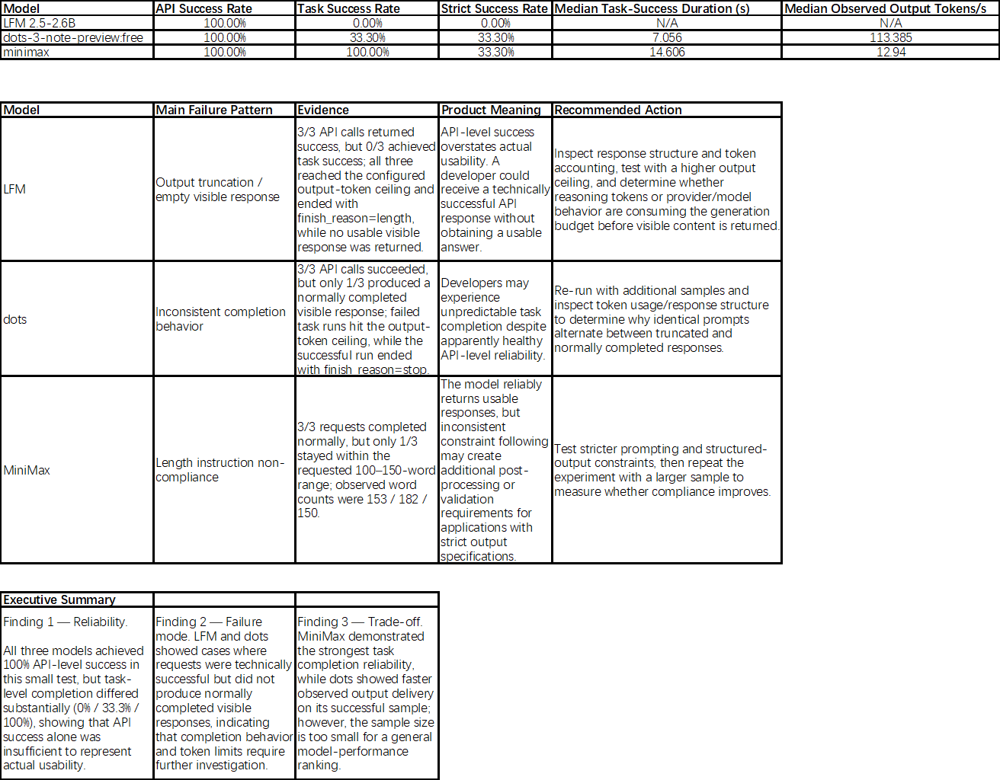

# OpenRouter Model Comparison

A small hands-on LLM evaluation project exploring API reliability, task completion, output-length control, and response performance across multiple models available through OpenRouter.

## 1. Project Overview

I built this project to understand how different LLMs behave when accessed through an API rather than only through a chat interface.

Using OpenRouter, I sent the same controlled task to three different models and collected request-level data including API status, token usage, response duration, output speed, and output-length compliance.

The purpose of this experiment was not to determine which model is universally "better." Instead, I wanted to understand how model behavior can be evaluated from a developer and model-operations perspective, including the difference between API availability, task completion, instruction following, and runtime performance.

This project also helped me practice a basic workflow for LLM evaluation:

API request → data collection → metric definition → analysis → failure investigation → product interpretation.


## 2. Models Tested

Three models available through OpenRouter were included in the experiment:

| Model | Runs |
|---|---:|
| LFM 2.5-2.6B | 3 |
| dots-3-note-preview | 3 |
| MiniMax | 3 |

Total planned requests: **9**

All models received the same controlled task so that their outputs could be compared under similar experimental conditions.


## 3. Experimental Setup

The experiment was conducted through the OpenRouter API using Python.

The API was accessed through an OpenAI-compatible client by changing the API `base_url` to the OpenRouter endpoint and specifying the corresponding OpenRouter model ID.

Basic experiment configuration:

| Item | Setting |
|---|---|
| Platform | OpenRouter |
| Language | English |
| Runs per model | 3 |
| Total runs | 9 |
| Prompt | Same controlled prompt |
| Target output length | 100–150 words |
| Maximum output tokens | 800 |
| Data analysis | Python + CSV + Excel |

For every request, the script recorded several fields including:

- timestamp
- run number
- model ID
- model label
- input tokens
- output tokens
- total tokens
- duration
- observed output tokens per second
- word count
- length compliance
- API status
- error information

The resulting data was exported to CSV for further analysis.


## 4. Evaluation Metrics

### API Success Rate

API Success Rate measures whether an API request successfully returned a response without an API-level error.

This metric describes service/API reliability, but it does not indicate whether the returned answer actually completed the requested task correctly.


### Task Success Rate

Task Success Rate measures whether the model produced a usable response that satisfied the basic task-completion criteria defined in the experiment.

This separates technical API availability from actual task performance.


### Strict Success Rate

Strict Success Rate applies a stricter evaluation rule to determine whether the response followed the specified output requirements, particularly the target output length.

A request can therefore be technically successful while still failing strict task evaluation.


### Median Task-Success Duration

This metric measures the median response duration among requests that successfully completed the task.

Median was used instead of relying only on the average because a small number of unusually slow requests can strongly distort mean latency in a small experiment.


### Observed Output Tokens/s

Observed Output Tokens/s is calculated from the number of generated output tokens and the observed request duration.

It is used here as an experimental throughput indicator.

It should not be interpreted as a precise provider-side throughput benchmark because the measured request duration can include additional network, routing, queueing, and API overhead.


## 5. Results

The summarized experiment results were:

| Model | API Success Rate | Task Success Rate | Strict Success Rate | Median Task-Success Duration | Median Observed Output Tokens/s |
|---|---:|---:|---:|---:|---:|
| LFM 2.5-2.6B | 100.0% | 0.0% | 0.0% | N/A | N/A |
| dots-3-note-preview | 100.0% | 33.3% | 33.3% | 7.056 s | 113.385 |
| MiniMax | 100.0% | 100.0% | 33.3% | 14.606 s | 12.940 |

These results demonstrate why API success alone is insufficient for evaluating an LLM integration.

All three models achieved a 100% API success rate in this experiment, but their task-level behavior was substantially different.

## Dashboard

The following dashboard summarizes the main experiment metrics:




## 6. Key Findings

### Finding 1 — API success does not equal task success

LFM achieved a 100% API success rate but a 0% task success rate.

This means that all API requests technically completed without API-level errors, but none of the responses satisfied the task-success criteria.

For model operations, this distinction is important: monitoring only HTTP/API success could make a model integration appear healthy even when users are receiving unusable outputs.


### Finding 2 — dots showed strong speed but inconsistent task completion

dots-3-note-preview achieved:

- 100% API Success Rate
- 33.3% Task Success Rate
- 33.3% Strict Success Rate

Among its task-successful results, its median duration was approximately **7.056 seconds**, while the median observed output speed was approximately **113.385 tokens/s**.

The experiment therefore suggests relatively strong observed generation performance, but inconsistent compliance with the requested task.


### Finding 3 — MiniMax completed the task consistently but showed weak strict length control

MiniMax achieved:

- 100% API Success Rate
- 100% Task Success Rate
- 33.3% Strict Success Rate

This distinction is particularly important.

Task Success Rate indicates that all three runs produced usable task outputs. However, Strict Success Rate shows that only one of the three outputs satisfied the stricter output-length requirement.

The outputs varied substantially in length across repeated runs using the same prompt.

This suggests that successful task completion and precise instruction compliance should be evaluated separately.


## 7. Product Interpretation

The experiment illustrates a basic principle of model evaluation:

> A model should not be evaluated using a single metric.

For a developer choosing a model, several dimensions may matter simultaneously:

**Reliability**

Can the API request complete successfully?

**Task completion**

Does the model actually perform the requested task?

**Instruction following**

Does the output satisfy specific constraints such as format or length?

**Latency**

How long does the user wait for a response?

**Throughput**

How quickly is output generated?

Different use cases may prioritize these dimensions differently.

For example, an interactive AI coding product may place greater emphasis on latency and response speed, while a structured content-generation workflow may care more about instruction compliance and output consistency.


## 8. Failure Analysis

One important lesson from the experiment was the need to separate different failure layers.

A model request can fail at several levels:

### Layer 1 — API Failure

Examples:

- provider error
- rate limiting
- invalid model ID
- network/API failure

In this case, the request itself does not successfully return a normal model response.


### Layer 2 — Task Failure

The API request succeeds, but the model does not complete the intended task successfully.


### Layer 3 — Constraint Failure

The model completes the general task but fails a stricter requirement such as output length.

This layered framework makes debugging more useful than treating every unsuccessful result as the same type of failure.


## 9. Limitations

This project is an exploratory experiment rather than a production-grade benchmark.

Several limitations should be considered.

First, each model was tested only three times. A sample size of three is too small to make statistically reliable claims about overall model or provider performance.

Second, the experiment used a limited task type. Model performance may change significantly across coding, reasoning, summarization, extraction, translation, tool calling, and other workloads.

Third, observed request duration includes more than model inference. OpenRouter routing, provider load, network conditions, rate limits, and queueing can all affect the measured result.

Fourth, Observed Output Tokens/s in this project is an application-side measurement rather than a provider-side benchmark.

Therefore, the results should be interpreted as observations from this specific experimental setup rather than universal rankings of the models.


## 10. What I Would Test Next

If I expanded this project, I would increase the number of runs per model and introduce multiple task categories.

A larger experiment could include:

- short-form generation
- long-form generation
- coding
- structured JSON output
- reasoning
- instruction-following tasks

I would also separate additional latency metrics where possible, such as:

- Time to First Token (TTFT)
- generation time
- end-to-end latency
- output throughput

This would make it easier to distinguish model generation performance from provider, routing, and network overhead.


## 11. What I Learned

Before this project, I mainly understood LLMs from the perspective of an end user.

Building the experiment helped me understand the developer side of model usage more concretely.

I learned how an OpenAI-compatible API client can communicate with OpenRouter, how model IDs are used to select models, and how API responses can be converted into structured operational data.

More importantly, I learned that evaluating a model requires separating API reliability from actual model behavior.

A successful API request does not necessarily mean that the model completed the task correctly, and task completion does not necessarily mean that the model followed every constraint precisely.

This changed the way I think about model evaluation: instead of asking only "Is this model good?", I now think in terms of specific use cases, measurable success criteria, failure patterns, latency, throughput, and product requirements.


## 12. Project Structure

```text
04-model-comparison/
│
├── model_comparison.py
│
├── README.md
│
├── results/
│   └── model_comparison_v2.csv
│
└── screenshots/
    └── dashboard.png

## 13. Tools Used
Python
OpenRouter API
OpenAI-compatible Python SDK
CSV
Microsoft Excel
Git
GitHub

## 14. Disclaimer

This is a small personal learning and evaluation project.

The results represent observations from a limited number of API requests under a specific experimental setup and should not be interpreted as official benchmarks or comprehensive evaluations of the models or providers.
    