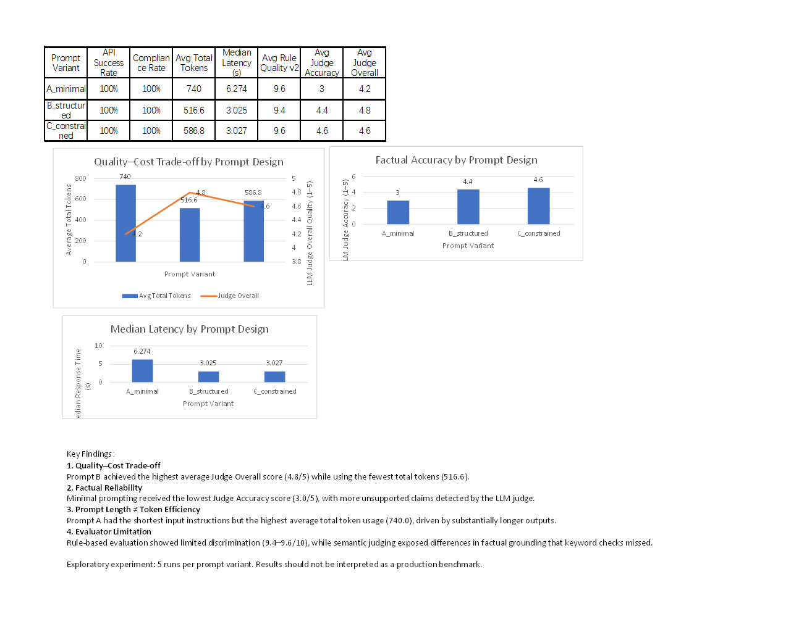

# Prompt Evaluation: Structure, Quality, Cost, and Reliability

## Project Overview

This experiment evaluates how different levels of prompt structure affect the quality, factual reliability, token usage, and latency of LLM-generated developer-facing content.

The task was to generate an English launch post for a fictional AI model, Spark-X1, while keeping the model, task, API environment, and reference information consistent across prompt variants.

Rather than treating prompt quality as a single score, the experiment combines:

- API-level metrics
- Rule-based evaluation
- Prompt-specific compliance checks
- LLM-as-a-Judge evaluation
- Token and latency analysis

The goal is not to establish a production benchmark, but to explore how prompt design changes developer-facing output and how different evaluation methods reveal different failure patterns.


## Research Question

> Under the same model, task, and API environment, how does increasing prompt structure affect task completion, instruction compliance, factual reliability, output quality, token usage, and response latency?


## Experimental Design

### Generator Model

- Model: `minimax/minimax-m3:free`
- API platform: OpenRouter
- Interface: OpenAI-compatible API
- Runs per prompt variant: 5
- Total generation requests: 15
- Language: English

### Reference Task

The model was asked to write a developer-facing launch post for the fictional model **Spark-X1**.

Reference information:

- Context window: 128K
- Input price: $0.20 / 1M tokens
- Output price: $0.80 / 1M tokens
- Tool calling
- JSON structured output
- OpenAI-compatible API
- Target users: AI application developers

Using a fictional model made it easier to distinguish supplied facts from unsupported claims introduced by the model.


## Prompt Variants

### A — Minimal

A short instruction asking the model to write a launch post using the supplied facts.

No explicit word limit, output structure, tone, or detailed factual constraints were specified.

### B — Structured

Added:

- Developer audience
- Professional English
- 120–180 word target
- Capability explanation
- Context and pricing information
- Explanation of OpenAI-compatible API value
- Call to action
- Explicit instruction not to invent information

### C — Constrained

Added more explicit control:

- Role definition
- Target developer profile
- Fixed content structure
- Required capability coverage
- Pricing section
- Developer-value explanation
- Call to action
- 120–180 word target
- Explicit prohibition on invented benchmarks, performance, availability, or unsupported capabilities


## Metrics

The experiment recorded request-level metrics including:

- API success
- Input tokens
- Output tokens
- Total tokens
- Request duration
- Observed output tokens per second
- Word count
- Prompt compliance
- Rule-based quality score
- LLM Judge scores


## Evaluation Iteration

### Evaluator v1 — Basic Rule-Based Checks

The first evaluator checked whether required facts and content elements appeared in each response.

All 15 responses received the maximum shared-quality score.

This revealed an evaluator saturation problem: the rubric could confirm basic coverage but could not distinguish meaningful differences in output quality.


### Evaluator v2 — Expanded Rule-Based Evaluation

The second evaluator added checks for:

- Correct context window
- Correct input/output pricing
- Tool calling
- JSON structured output
- OpenAI compatibility
- Developer-value language
- Unsupported-claim keywords
- Call to action

The resulting average scores were:

| Prompt | Rule-Based Quality v2 |
|---|---:|
| A — Minimal | 9.6 / 10 |
| B — Structured | 9.4 / 10 |
| C — Constrained | 9.6 / 10 |

The evaluator produced some variation, but keyword-based checks still failed to detect several semantic unsupported claims.

Examples included claims related to performance, latency, reliability, and promotional benefits that were not present in the reference information.


### LLM-as-a-Judge

A separate model was then used as a semantic evaluator to reduce dependence on keyword matching.

Judge dimensions:

- Accuracy
- Developer Value
- Clarity
- Conciseness
- Overall Quality

The Judge was provided with the reference facts and candidate response, but not the prompt variant label, reducing direct prompt-label bias.

The generator and Judge used different models to avoid relying on the generator as its own sole evaluator.


## Results

| Metric | A — Minimal | B — Structured | C — Constrained |
|---|---:|---:|---:|
| API Success Rate | 100% | 100% | 100% |
| Compliance Rate | 100% | 100% | 100% |
| Avg Total Tokens | 740.0 | **516.6** | 586.8 |
| Median Latency | 6.274 s | **3.025 s** | 3.027 s |
| Rule Quality v2 | 9.6 / 10 | 9.4 / 10 | 9.6 / 10 |
| Judge Accuracy | 3.0 / 5 | 4.4 / 5 | **4.6 / 5** |
| Judge Overall | 4.2 / 5 | **4.8 / 5** | 4.6 / 5 |


## Dashboard




## Key Findings

### 1. Structured prompting showed the strongest quality–cost trade-off

Prompt B achieved the highest average Judge Overall score (4.8/5) while using the fewest average total tokens (516.6).

Under this experimental setup and evaluation rubric, moderate prompt structure produced the strongest observed quality–efficiency trade-off.


### 2. Shorter prompts did not mean lower total token usage

Prompt A used the shortest instructions but produced substantially longer responses.

As a result, it consumed an average of 740 total tokens, compared with 516.6 for Prompt B.

This demonstrates an important distinction between **prompt length** and **total request cost**.


### 3. Stronger constraints improved factual control

Prompt A received an average Judge Accuracy score of 3.0/5, compared with 4.4 for Prompt B and 4.6 for Prompt C.

Semantic evaluation identified unsupported claims in minimally constrained outputs that the rule-based evaluator failed to detect.

This suggests that explicit factual constraints can be useful when generating developer-facing model information where unsupported claims create product and communication risk.


### 4. More constraints did not automatically produce the best overall result

Prompt C achieved the highest Judge Accuracy score, but Prompt B achieved a higher Judge Overall score while using fewer total tokens.

In this experiment, additional constraints improved control but did not produce a clear overall-quality advantage.


### 5. Rule-based and semantic evaluation detect different failure patterns

Rule-based v2 scores remained tightly clustered between 9.4 and 9.6.

The LLM Judge exposed a much larger difference in factual accuracy.

This illustrates a limitation of keyword-based evaluation: it is reproducible and auditable, but can miss semantic problems that are not represented in predefined rules.


## Latency Interpretation

Prompt B and Prompt C had nearly identical median latency:

- B: 3.025 s
- C: 3.027 s

Prompt C also contained a 65.499-second latency outlier.

For this reason, median latency was used in the dashboard instead of relying only on mean latency.

Given the small sample and possible effects from provider routing, load, network conditions, and free-tier infrastructure, the experiment does not claim that prompt structure directly caused the observed latency differences.


## Evaluation Limitations

This experiment has several important limitations:

1. Only five runs were performed per prompt variant.
2. A single generator model was tested.
3. The experiment used a free OpenRouter endpoint, so provider conditions may affect latency and availability.
4. Rule-based evaluation depends on predefined keywords and heuristics.
5. LLM-as-a-Judge can introduce judge bias, scoring variance, and model-specific preferences.
6. Several Judge dimensions showed score saturation, particularly Developer Value, Clarity, and Conciseness.
7. The experiment evaluates one developer-marketing task and should not be generalized to all prompting tasks.

The results should therefore be interpreted as an exploratory case study rather than a production benchmark.


## Developer Growth Relevance

For developer-facing AI products, prompt and evaluation design can affect more than content quality.

The same workflow can support tasks such as:

- Model launch content evaluation
- Developer documentation QA
- Model-card consistency checks
- API tutorial evaluation
- Automated content quality monitoring
- Detection of unsupported product claims
- Quality/cost trade-off analysis

The experiment also demonstrates why API success alone is insufficient as a product-quality metric: a technically successful request can still produce content that is inaccurate, inefficient, or poorly aligned with developer requirements.


## Project Files

```text
05-prompt-evaluation/
├── prompt_evaluation.py
├── reevaluate_results.py
├── llm_judge.py
├── prompt_evaluation_dashboard.xlsx
├── README.md
├── requirements.txt
├── results/
│   ├── prompt_evaluation_results.csv
│   ├── prompt_evaluation_results_v2.csv
│   └── prompt_evaluation_judged.csv
└── screenshots/
    └── dashboard.png
```


## Conclusion

The experiment suggests that prompt engineering is not simply a matter of adding more instructions.

In this specific task, a structured prompt achieved the strongest observed balance between output quality and token efficiency, while a more constrained prompt provided slightly stronger factual control.

The evaluation process also showed that evaluator design matters: rule-based checks were useful for deterministic validation, while semantic judging identified factual issues that keyword rules missed.

A practical evaluation workflow therefore benefits from combining deterministic checks, semantic evaluation, and human review rather than relying on a single quality score.